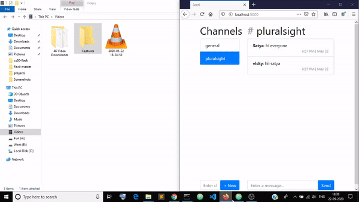

# Secr8

Slack-like clone using python and javascript



### Installation

Run the below command to install all packages:
```
pip install -r requirements.txt
```

### Running

Please run application.py by using `python application.py` instead of `flask run`. Running `flask run` will get a `ValueError: signal only works in main thread` as by [Flask-SocketIO issue](https://github.com/miguelgrinberg/Flask-SocketIO/issues/817)

### Contents
You will find all client side code in static/script.js \
All server side code in application.py \
A styles file was added in /static.

#### How to use: 

1. First Enter your Username to start chatting
2. You can create new channel by naming something diffrent than already listed
3. You can chat on channel you desire
4. You can close the tab, and come back to where you left off


